  

  <a href="https://dist-epnfqfug.devinapps.com"><b>Live demo ↗</b></a> &nbsp;·&nbsp;
  <a href="https://github.com/dkcb/flux">FLUX</a> &nbsp;·&nbsp;
  <a href="https://linkedin.com/in/dkcb">LinkedIn</a> &nbsp;·&nbsp;
  <a href="mailto:rscoper@proton.me">rscoper@proton.me</a>

---

Software-engineering student at **Codam (42)**, Amsterdam. I work from low-level **C** up through **TypeScript** full-stack and **Python** ML. Most recently I've been building infrastructure that lets AI agents hold wallets and spend money under human-set rules.

I'd rather you read the code than read adjectives, so each project below says what it actually is — including the caveats.

### Selected work

<table>
  <tr>
    <td width="50%"></td>
    <td width="50%"></td>
  </tr>
  <tr>
    <td width="50%"></td>
    <td width="50%"></td>
  </tr>
  <tr>
    <td width="50%"></td>
    <td width="50%"></td>
  </tr>
</table>

### Stack

**Languages** C · C++ · TypeScript · Python
**Web** React · Node · Express · NestJS · Vite
**Data / ML** PostgreSQL · Drizzle · NumPy · models from scratch
**Tooling** Git · Linux · Jest · Docker

### Reach me

Open to internships and junior roles. Fastest way to judge me is the code — start with [FLUX](https://github.com/dkcb/flux) or click around the **[live interactive overview ↗](https://dist-epnfqfug.devinapps.com)**.

- GitHub: [@dkcb](https://github.com/dkcb)
- LinkedIn: [in/dkcb](https://linkedin.com/in/dkcb)
- Email: [rscoper@proton.me](mailto:rscoper@proton.me)
